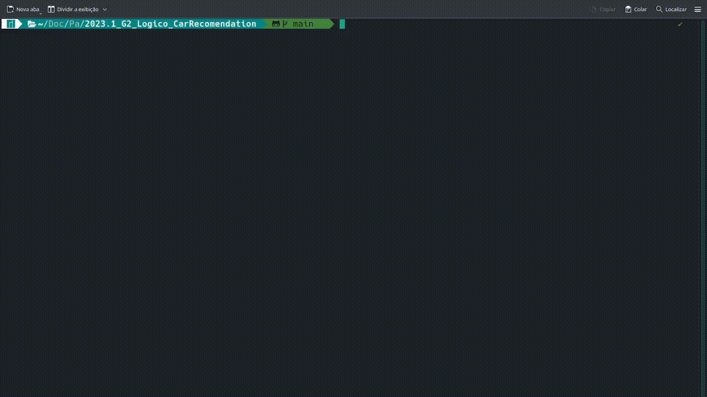

# Car Recomendation

**Disciplina**: FGA0210 - PARADIGMAS DE PROGRAMAÇÃO - T01  
**Nro do Grupo (de acordo com a Planilha de Divisão dos Grupos)**: 02 
**Paradigma**: Lógico 

## Alunos

| Matrícula  | Aluno                            |
| ---------- | -------------------------------- |
| 18/0108344 | Rafael Berto Pereira             |
| 20/0017519 | Eurico Menezes de Abreu Neto     |
| 19/0016663 | Lucas Pimentel Quintão           |
| 19/0044403 | Victor Souza Dantas Martins Lima |
| 19/0033088 | Lucas Braun Vieira Xavier        |
| 20/0019228 | Gustavo Martins Ribeiro          |
| 19/0055201 | Matheus Calixto Vaz Pinheiro     |
| 19/0027088 | Eliás Yousef Santana Ali         |
| 19/0025379 | Brenno Oliveira Silva            |

## Sobre

Um projeto que utiliza Prolog para oferecer recomendações personalizadas de carros, levando em consideração marca, transmissão, ano e combustível. Facilita a escolha do usuário, fornecendo opções alinhadas às suas preferências.

## Screenshots

## Instalação

**Linguagens**: Prolog 
**Tecnologias**: SWI Prolog, Win-Prolog 

## Uso

1. Baixe o repositório
2. Acesse a pasta src/
`cd src/`
3. Acesse o shell do swi-prolog
`swipl`
4. Importe o arquivo main
`[main].`
5. Para iniciar utilize o comando
`start`

## Vídeo

[Apresentação](https://www.youtube.com/watch?v=bqKDU5b_leE)

## Participações

|Nome do Membro | Contribuição | Significância da Contribuição para o Projeto (Excelente/Boa/Regular/Ruim/Nula) |
| -- | -- | -- |
| Lucas Pimentel | Contribui com o script para montar a base de fatos, no desenvolvimento de funções para montar o perfil do usuário e auxiliei no desenvolvimento de funções de recomendação. Acredito que este paradigma foi um desafio maior para a equipe, tanto na concepção da ideia do projeto quanto para o desenvolvimento dele. Poderia ter contribuido mais se tivesse me organizado melhor durante a semana.| Excelente |
| Eurico | Contribui majoritariamente no front-end com o Gustavo, como eu estava em um sistema em que o Win-Prolog não funciona fiz pair programming com ele, tive uma contribuição mais singela no back também. Senti que foi um projeto mais difícil para mim e para o grupo, se eu tivesse me organizado melhor teria conseguido contribuir mais. | Boa |
|Rafael Berto Pereira| Contribui mais no "backend" do projeto. Ajudei muito na parte de entender a lógica por tras da regra findall() consequentemente no filtro para o recomendador. Não foi uma das minhas linguagens preferidas, mas consegui entender o poder de dedução da linguagem. O trabalho poderia ter avançado mais se não fosse a dificuldade inicial de entender o paradigma dessa linguagem | Excelente|
| Victor Lima| Contribui na criação do filtro por combustível, posteriormente trabalhei com o Lucas e o Rafael na parte de mapeamento para o perfil de usuário e adequação da recomendação. Sinto que esse paradigma foi mais complexo em relação ao anterior, a maioria da equipe sentiu dificuldade para se adequar,porém , acredito que obtivemos um bom resultado | Excelente |
| Lucas Braun | Contribuí parte da recomendação por transmissão. Apesar de também ser um paradigma interessante, o lógico não me cativou tanto quanto o funcional, principalmente por parecer ter menos usos e também devido a qualidade e clareza da documentação. | Regular |
| Gustavo Martins | Minha principal contribuição para o projeto Car Recommendation refere-se ao desenvolvimento e evolução da interface gráfica do projeto. Diante disso, com o auxilio de outros colegas, consegui resolver diverços problemas que por ventura surgiram ao longo do desenvolvimento. Além disso, participei das diverças reuniões para definir as diferentes diretrizes do projeto para tomada de decisões e definição de escopo. | Excelente |
| Matheus Calixto | Contribui na parte de recomendação por transmissão e também na parte de recomendação geral de acordo com os filtros escolhidos pelo usuário. Achei o paradigma interessante, mas acredito que se tivesse uma documentação melhor e uma comunidade mais ativa e popular seria de grande ajuda para o desenvolvimento do projeto | Excelente | 
| Eliás Yousef | Minhas principais atribuições foram auxiliar no desenvolvimento dos filtros, em especial do preços desejados, e construção da interface gráfica do projeto. No começo senti uma certa dificuldade para compreensão do paradigma e da linguagem, o que acabou consumindo bastante tempo, que poderia ter sido utilizado para o desenvolvimento propriamente dito. | Boa |
| Brenno Oliveira | As minhas contribuições consistiram na criação dos filtros de ano. A forma que o paradigma funciona é certamente diferente do que estava acostumado, porém não gostei da forma que o código fica estruturado. | Boa |

## Outros

Quaisquer outras informações sobre o projeto podem ser descritas aqui. Não esqueça, entretanto, de informar sobre:
(i) Lições Aprendidas;
(ii) Percepções;
(iii) Contribuições e Fragilidades, e
(iV) Trabalhos Futuros.

## Fontes

- https://www.swi-prolog.org
- https://www.lpa.co.uk/win.htm
- https://www.kaggle.com/datasets/akshaydattatraykhare/car-details-dataset
