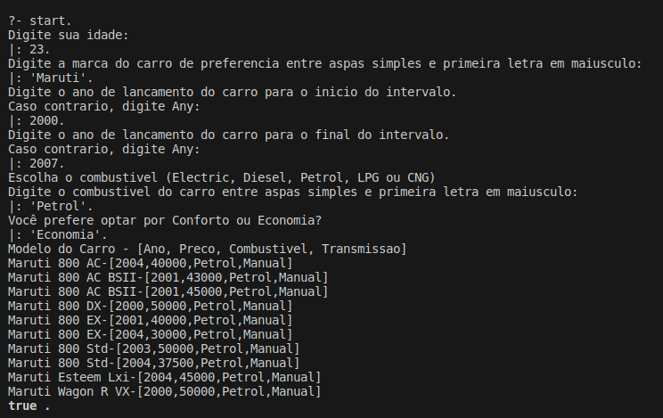
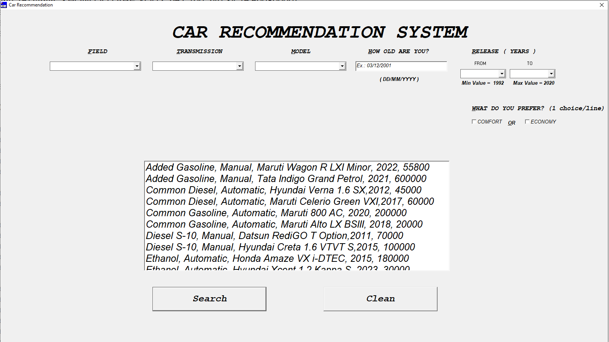

# Car Recomendation

**Disciplina**: FGA0210 - PARADIGMAS DE PROGRAMAÇÃO - T01  
**Nro do Grupo (de acordo com a Planilha de Divisão dos Grupos)**: 02 
**Paradigma**: Lógico 

## Alunos

| Matrícula  | Aluno                        |
| ---------- | ---------------------------- |
| 18/0108344 | Rafael Berto Pereira         |
| 20/0017519 | Eurico Menezes de Abreu Neto |
| 19/0016663 | Lucas Pimentel Quintão       |
| 19/0044403 | Victor Souza Dantas Martins Lima|

## Sobre

Um projeto que utiliza Prolog para oferecer recomendações personalizadas de carros, levando em consideração marca, transmissão, ano e combustível. Facilita a escolha do usuário, fornecendo opções alinhadas às suas preferências.

## Screenshots

## Instalação

**Linguagens**: Prolog 
**Tecnologias**: SWI Prolog, Win-Prolog 
Descreva os pré-requisitos para rodar o seu projeto e os comandos necessários.
Insira um manual ou um script para auxiliar ainda mais.
Gifs animados e outras ilustrações são bem-vindos!

## Uso

Explique como usar seu projeto.
Procure ilustrar em passos, com apoio de telas do software, seja com base na interface gráfica, seja com base no terminal.
Nessa seção, deve-se revelar de forma clara sobre o funcionamento do software.

## Vídeo

Adicione 1 ou mais vídeos com a execução do projeto.
Procure:
(i) Introduzir o projeto;
(ii) Mostrar passo a passo o código, explicando-o, e deixando claro o que é de terceiros, e o que é contribuição real da equipe;
(iii) Apresentar particularidades do Paradigma, da Linguagem, e das Tecnologias, e
(iV) Apresentar lições aprendidas, contribuições, pendências, e ideias para trabalhos futuros.
OBS: TODOS DEVEM PARTICIPAR, CONFERINDO PONTOS DE VISTA.
TEMPO: +/- 15min

## Participações

Apresente, brevemente, como cada membro do grupo contribuiu para o projeto.
|Nome do Membro | Contribuição | Significância da Contribuição para o Projeto (Excelente/Boa/Regular/Ruim/Nula) |
| -- | -- | -- |
| Lucas Pimentel | Contribui com o script para montar a base de fatos, no desenvolvimento de funções para montar o perfil do usuário e auxiliei no desenvolvimento de funções de recomendação. Acredito que este paradigma foi um desafio maior para a equipe, tanto na concepção da ideia do projeto quanto para o desenvolvimento dele. Poderia ter contribuido mais se tivesse me organizado melhor durante a semana.| Excelente |
| Eurico | Contribui majoritariamente no front-end com o Gustavo, como eu estava em um sistema em que o Win-Prolog não funciona fiz pair programming com ele, tive uma contribuição mais singela no back também. Senti que foi um projeto mais difícil para mim e para o grupo, se eu tivesse me organizado melhor teria conseguido contribuir mais. | Boa |
| Victor Lima| Contribui na criação do filtro por combustível, posteriormente trabalhei com o Lucas e o Rafael na parte de mapeamento para o perfil de usuário e adequação da recomendação. Sinto que esse paradigma foi mais complexo em relação ao anterior, a maioria da equipe sentiu dificuldade para se adequar,porém , acredito que obtivemos um bom resultado | Excelente |
## Outros

Quaisquer outras informações sobre o projeto podem ser descritas aqui. Não esqueça, entretanto, de informar sobre:
(i) Lições Aprendidas;
(ii) Percepções;
(iii) Contribuições e Fragilidades, e
(iV) Trabalhos Futuros.

## Fontes

- https://www.swi-prolog.org
- https://www.lpa.co.uk/win.htm
- https://www.kaggle.com/datasets/akshaydattatraykhare/car-details-dataset
